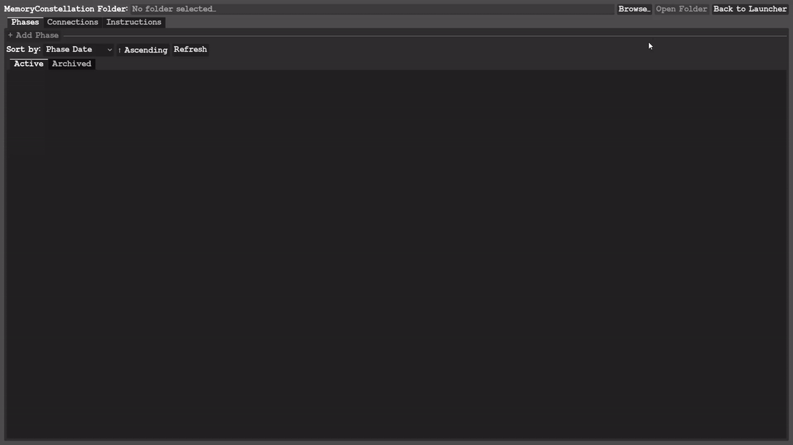
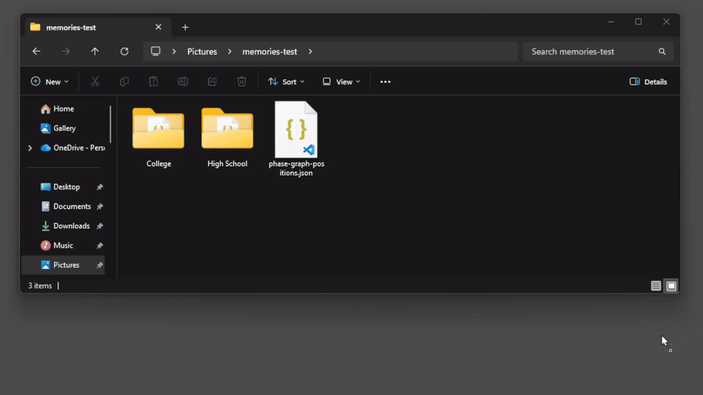
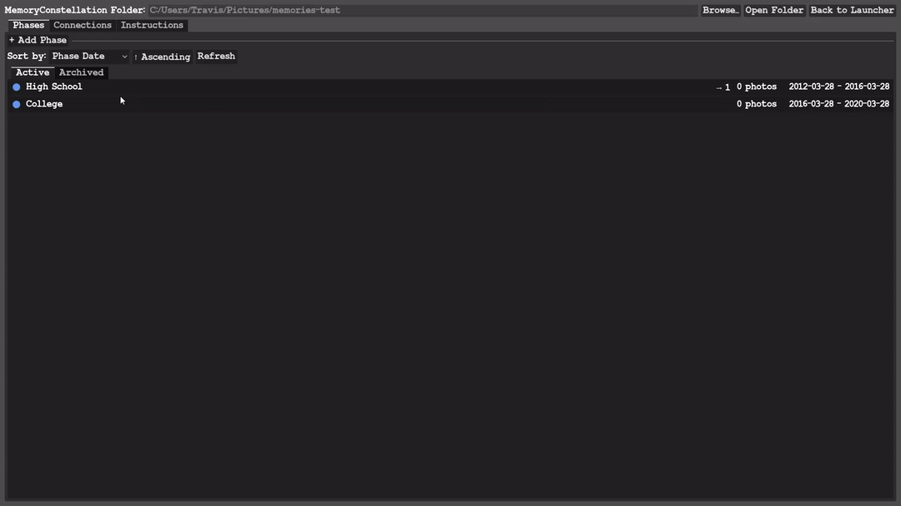
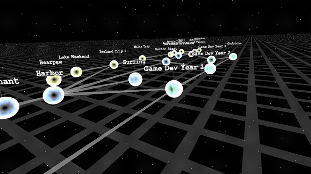
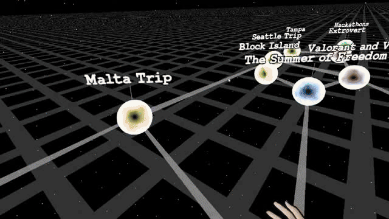
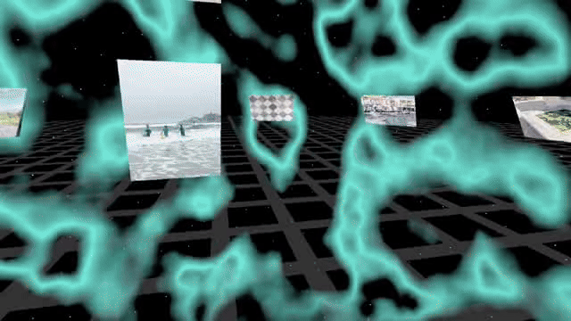

#  Memory Constellation 


An interactive app for organizing and reliving your life memories. Manage your phases on desktop, then explore them in VR as a constellation that documents your history.

---

> [!WARNING]
> Back up your photos and notes before using with this app.


## How it Works
Define the phases of your life and form connections between them.



Organize your photos in the folders. Add in your existing photo folders.



Edit phases and lock them to form your unique constellation.



As you add more photo folders, the story of your life is shown in the constellation.



Step into your memories and design your story in 3D space.



Move around and resize your photos and notes to feel like you're back in that memory.


---

## Requirements

- **Godot 4.6**
- A VR headset supported by OpenXR (for VR mode)

---

## Setup

1. Clone or download this repo.
2. Open **Godot 4.6** and import the project from the `memory-constellation/` subfolder (where `project.godot` lives).
3. The **godot-xr-tools** addon is included — no separate install needed. Enable in **Project → Project Settings → Plugins** if they aren't already active.
4. Run the project. The launcher will appear with **Desktop** and **VR** options.

---

## Memory Constellation Folder Structure

The app reads a folder you point it at. Each direct subfolder becomes a phase.

```
MyMemories/
├── 2018 College/
│   ├── phase-config.json        # auto-created on first edit
│   ├── photo1.jpg
│   ├── photo2.png
│   └── journal.md
├── 2020 Road Trip/
│   ├── phase-config.json
│   └── ...
└── ...
```

Supported photo formats: `jpg`, `jpeg`, `png`, `gif`, `bmp`, `webp`, `tiff`, `tif`, `heic`

Markdown `.md` files inside the phase folder will be displayed as notes you can move around in the world.

---

## Desktop — Configuration Tool

1. Launch the app and click **Desktop**.
2. Click **Browse...** and select your MemoryConstellation folder.
3. Your phases appear in the list automatically.

**Phase list**
- **+ Add Phase** — creates a new phase subfolder and config file.
- **Right-click** a phase to **Edit** (name, color, dates, playlist link) or **Archive / Unarchive** it.
- **Sort** by name, date, photo count, or connection count.
- **Refresh** re-scans the folder (useful after copying in photos externally).

**Connections tab**
- Click two phase nodes to add or remove a connection between them.
- Drag nodes to rearrange the graph. Positions are saved automatically.
- Right-click a node to lock/unlock it from physics simulation.

---

## VR — Constellation View

Point your controller at a glowing sphere (phase) and **hold the trigger for 1 second** to enter it.

---

## VR — Phase Ground View

Photos and notes appear as grabbable 3D objects around you.

| Action | How |
|---|---|
| Toggle edit mode | **A / X** (left hand) or **B / Y** (right hand) |
| Remote grab (single hand) | In edit mode: aim at object, hold **Grip** |
| Remote grab (two hands) | Grab with one hand, aim other and grip — spread/pinch to scale |
| Physical grab | Reach close to object — grip handles appear at corners |
| Navigate to connected phase | Aim at directional portal, hold trigger 1 s |
| Return to constellation | Aim at **Return to Constellation** portal, hold trigger 1 s |
| Exit without saving | Aim at **Cancel Changes**, hold trigger 1 s |
| Reset photo positions | Aim at **Reset Positions**, hold trigger 1 s |

Changes are saved automatically when navigating away.

---

## Data Files

| File | Location | Purpose |
|---|---|---|
| `phase-config.json` | Inside each phase folder | Phase name, color, dates, playlist, connections |
| `phase-graph-positions.json` | Inside each phase folder | Node positions in the connections graph |
| `mc_session.json` | `user://` (Godot user data dir) | Last folder, sort settings |

---

## Project Structure

```
memory-constellation/
├── project.godot
├── scenes/          # All .tscn scene files
├── scripts/         # All .gd GDScript files
├── assets/
│   ├── fonts/
│   ├── materials/
│   ├── shaders/
│   └── tutorial/
└── addons/
    └── godot-xr-tools/   # VR controller support (v4.5.1)
```

Key scenes:
- `scenes/launcher_view.tscn` — entry point
- `scenes/configuration_tool_view.tscn` — desktop tool
- `scenes/game_root.tscn` — VR main scene
